+++
title = "Dragon - Kompletní návod (Dragon Complete Guide)"
slug = "tutorial-dragon-complete-guide"
date = 2003-10-08T00:00:00
draft = false
categories = ["Tutorials"]
tags = ["Marty", "Manawydan Archive"]

[params]
  source = "ultima-cz"
+++

Dragon je utilita pro tvorbu vlastní Ultima Online mapy pracující pod OS Windows. Mapu (map0.mul) generuje z BMP obrázku, který si nakreslíte podle šablony barev, která je součástí programu. Dragon SP (Dragon Static Patch) zmrazí dynamické itemy do souborů statics0.mul a staidx0.mul.

## Potřebné věci

- Nainstalovaná Ultima Online
- Vlastní UO emulátor
- Program Dragon
- Program Malování (nebo editor pro BMP obrázky)

## Postup

### 1) Vytvoření mapy

Otevřete grafický editor a vytvořte čisté bílé plátno o velikosti 6144x4096 pixelů. Takto vytvořený BMP soubor má okolo 25 MB.

### 2) Otevření palety barev

Otevřete soubor colortable_eng.bmp, který je v programu Dragon. Důležité: čísla levelu (0, 2, 5, 10) znamenají výšku mapy (Z souřadnici). 1 pixel = 1 UO políčko, tzn. že základní velikost mapy je 6144x4096 hracích políček.

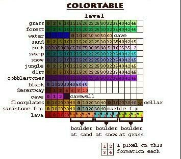

### 3) Tvorba mapy

Různé druhy povrchu musí být od sebe vzdáleny minimálně 2 pixely, jinak je Dragon špatně vygeneruje. Příklad:

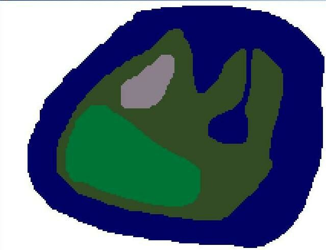

- Water (voda) ve výšce -5
- Grass (tráva) ve výšce 0
- Forest (les) ve výšce 10
- Rock (skála) ve výšce 70
- Bílé pozadí je "černota" (black) ve výšce 0

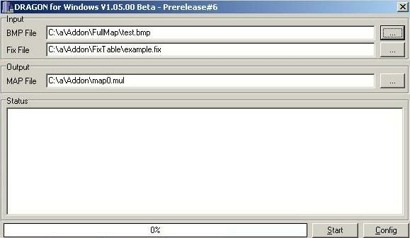

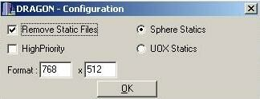

### 4) Spuštění Dragon

Po spuštění se objeví uvítací obrazovka s hláškou "Attention". Kliknete OK. V hlavním menu:

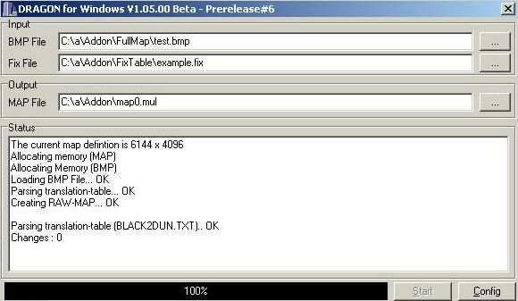

- **Input > BMP File**: cesta k vašemu BMP souboru
- **Input > Fix File**: soubor na drobné úpravy
- **Output > MAP File**: cesta kam bude vytvořen map0.mul
- **Config**: Format 768x512 znamená velikost mapy 6144x4096

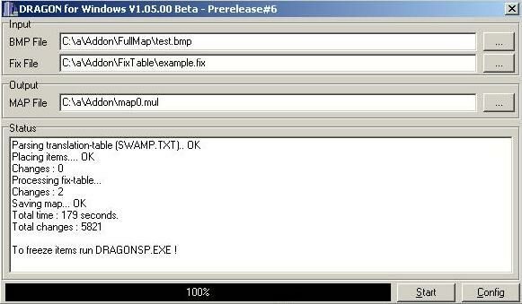

Kliknete **Start** a program generuje mapu.

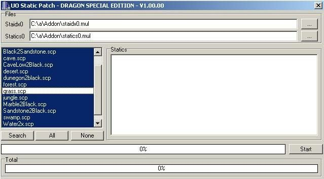

### 5) Spuštění DragonSP.exe

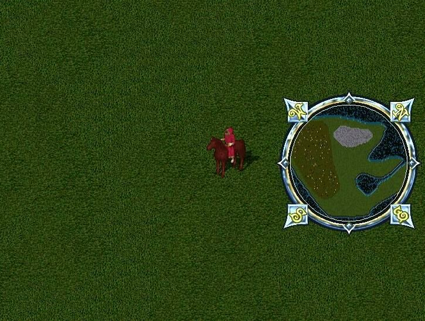

V menu Files:
- **Staidx0**: cesta pro soubor staidx0.mul
- **Statics0.mul**: cesta pro soubor statics0.mul

V levém menu vyberte scripty itemů. Vyberme "All" (všechny), kromě grass (trávy).

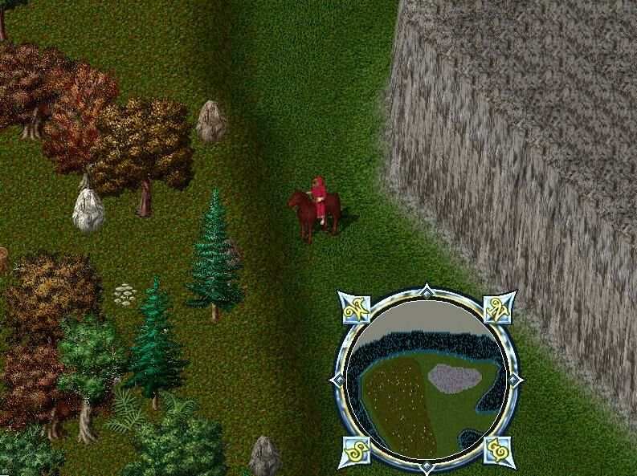

Po kliknutí **Start** se program zeptá, zda chcete smazat staré statické itemy — vždy odpovězte **ANO**.

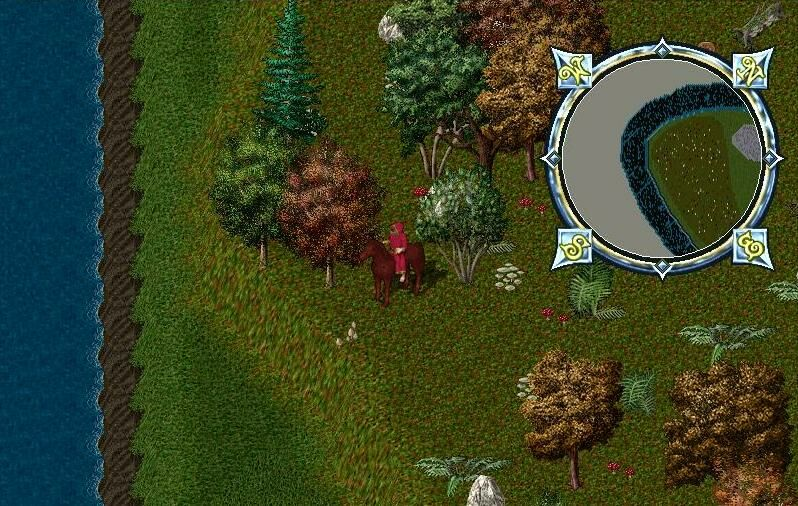

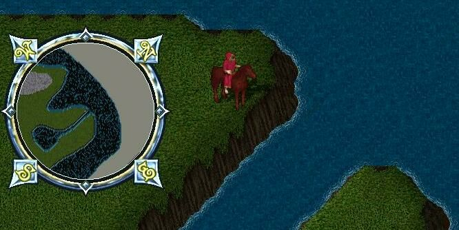

### 6) Kopírování souborů

Nakopírujte vytvořené soubory do adresáře s instalovanou UO a spusťte emulátor.

### 7) Užitečné rady

Když kreslíte vodu (i jiné povrchy), nikdy nedělejte hranaté přechody — ve hře by jste pak měli nehezkou chybu v mapě. Vždy je lepší přecházet po jednom pixelu. Ukládejte BMP ve formátu 256 barev.

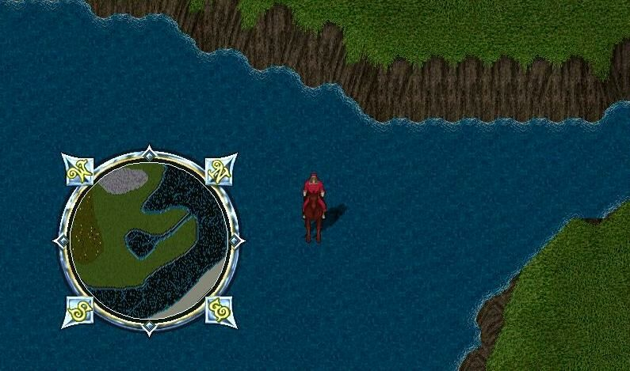

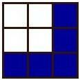

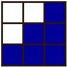

---

*Archived from [ultima.cz](https://ultima.cz/) — Czech Ultima Online community site.*
