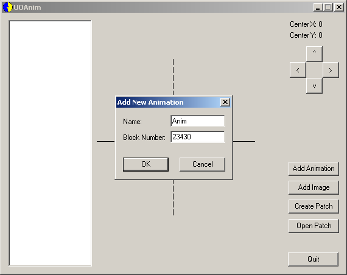
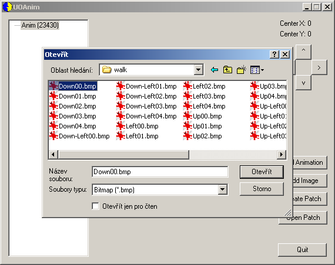
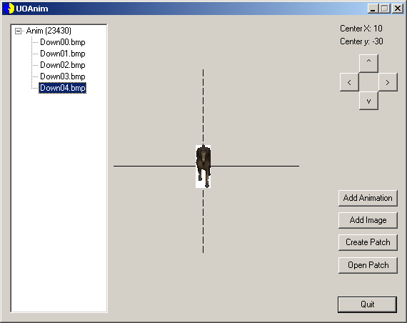
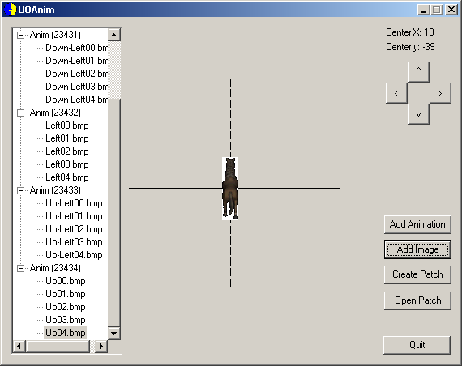
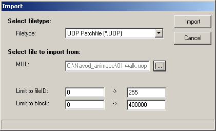
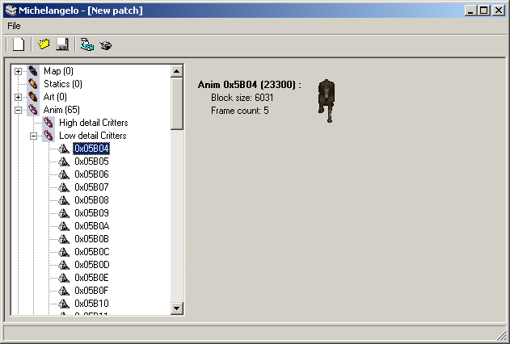

V tomto návodu si ukážeme, jak vložit hotovou animaci do verdat/mulu.
K práci budeme potřebovat tyto programy: **UOAnim**, **Michelangelo**, **UO Animation Calculator**, případně ještě **Mulpatcher** pro vložení animace do MULu.

Ještě než začneme, doporučuji všem si přečíst návod na vkládání animací, který napsal M@B. Dozvíte se v něm všechny důležité informace o animacích. Kolik políček animace mají jednotlivé pohyby, jak se počítají pozice pro jednotlivé fáze animací apod.

Teď k samotnému vkládání animací. Pro příklad jsem si vybral klasickou animaci koně, kterou jsem si vytáhnul pomocí InsideUO do jednotlivých obrázků, ty jsem následně zmenšil a z koně je v tu ránu hříbě :)

Spustíme **UO Animation Calculator** a do kolonky nahoře vložíme číslo **221** a zmáčkneme Enter. Toto číslo nám udává ID budoucí animace. Naše budoucí animace bude na pozici 222. UO Calculator bohužel počítá správně jen HIGH DETAIL animace. Pokud děláte LOW DETAIL animaci, odečtěte od vašeho ID -1.

Ve spodní části programu dostaneme hodnoty:
- **First Animation Frame: 23430**
- **Last Animation Frame: 23494**

Nás hlavně zajímá číslo prvního políčka animace, které je v našem případě **23430**. Toto číslo si zapamatujte.

UO Animation Calculator zavřete a spusťte **UOAnim**. Program je bohužel nedodělaný a neumí načíst hotové animace, proto při tvorbě animace vždy na dokončení nějaké části animaci uložte a pokračujte dál. Program nemá ani žádné undo, proto pokud se spletete při zadávání čísla nebo vkládání obrázku, budete muset začít od začátku.

Klikněte na tlačítko **Add Animation**.

Kolonky **Name** si nemusíte všímat — slouží jako popisek, ale díky nemožnosti načítat uložené animace je nám k ničemu. Do kolonky **Block Number** napíšeme **23430**, což je číslo, které máme z UO Animation Calculatoru a značí nám číslo prvního políčka animace.

Klikněte na **OK** a následně na **Add Image**.

V tento moment vložíme první políčko animace, otázkou je ale jaké :). Odpověď je jednoduchá. Animace s ID 222 patří mezi Low Detail Critters a podle InsideUO zjistíte, že první animace je WALK, následuje RUN, STAND apod. Tohle si zapamatujte, protože v tomto pořadí musíme postupně animaci složit. Z návodu od M@Ba víme, že animace jsou nakresleny do několika světových stran (dolů, dolů-vlevo, vlevo, nahoru-vlevo, nahoru). Začněme tedy obrázkem pro pohyb dolů.

Vložíme tedy první políčko animace pro pohyb dolů.

Tlačítkem Add Image vložíme zbytek políček animací.

Když máme vložené snímky pro pohyb dolů, musíme pokračovat snímky dolů-vlevo. Klikněte tedy znovu na **Add Animation** a do kolonky Block Number napište **23431** a zase vložte pomocí Add Image všechny políčka animace vlevo-dolů. Až je budete mít vložený, opět klikněte na Add Animation a zadejte číslo 23432 — tedy opět ho zvedněte o 1 a začněte vkládat políčka animace vlevo. Tímto způsobem pokračujte, až vložíte všechny políčka animace pro chůzi (WALK) do všech stran. Výsledek by měl vypadat následovně:

Tím máme první část animace hotovou a proto si ji uložte pomocí **Create Patch**. Pojmenujeme ji například: 01-walk.uop

Zavřete program UOAnim a znovu ho spusťte. A pokračujeme v tvorbě další části animace. Podle InsideUO už víme, že bude následovat animace RUN. Klikněte tedy na Add Animation a vložte číslo bloku **23435**, protože u animace WALK jsme skončili u 23434. Vložte obrázky animace pro běh — opět začněte animací směrem dolů a pokračujte vkládáním obrázků stejně jako u animace WALK a po každém hotovém typu animace ji nezapomeňte uložit.

Pokud vše děláte dobře a ukládáte jak jsem vám řekl, budete mít hotovo 13 souborů s jednotlivými fázemi animace.

Spustíme si **Michelangelo**. Nyní potřebujeme jednotlivé části spojit a vše uložit do verdata.mul aby byla animace použitelná.

Klikneme tedy na tlačítko Import, vybereme **Filetype: UOP Patchfile (*.UOP)** v kolonce **MUL:** si najdeme první fázi animace **01-walk.uop** a klikneme na **Import**.

Tímto způsobem vložíme zbytek hotových částí animace.

Nyní tedy máme vloženou celou animaci a tu následně uložíme do verdata.mul. Klikněte tedy na tlačítko Export a vyberte cestu, kam chcete nová verdata.mul uložit. Pokud chcete vložit animaci do již existujícího souboru, zaškrtněte políčko **Include original verdata**.

Tímto máme vložení nové animace za sebou. Vytvořená verdata můžeme nahrát do adresáře s Ultimou Online a výsledek si můžete prohlédnout v InsideUO nebo UOAnimTool.

Návod by mohl v tomto místě končit. Nicméně si ještě ukážeme jak vložit hotovou animaci do MULu. Toto je nutné v případě, že používáme klienta novějšího než 4.0.5b, který už věci ze souboru verdata.mul nenačítají.

Spustíme tedy **Mulpatcher**. Nastavte si cestu k souborům v rámečku **Animations**. Jedná se o soubory Anim.idx a Anim.mul. Nastavte také cestu k souboru Verdata.mul ve kterém máte uloženou naši animaci. U Animations i Verdata klikněte na tlačítko **Load**. Tím se načtou informace z těchto souborů do paměti, ale POZOR — u animací se veškeré změny provádějí rovnou (mazání, ukládání).

V dolní liště se přepněte na **Anim** a najdeme si naší animaci. Její ID 222, což v HEX čísle znamená 0xDE. Jelikož je animace uložená ve verdatech, je číslo 0xDE označeno zelenou barvou.

Klikneme na animaci **0xDE** pravým tlačítkem myši a vybereme možnost **Save to file** a soubor (například s jménem 222.vd) uložíme.

Mulpatcher ukončíme a zase spustíme. Tentokrát si načteme pouze soubory Anim.idx a Anim.mul a opět se přepneme do záložky Anim. Najdeme si opět pozici 222 (0xDE), klikneme na něj pravým tlačítkem a vybereme možnost **Load from file** a vybereme soubor, který jsme před chvilkou uložili (222.vd). Tím se nám animace uloží přímo do souboru Anim.mul. Mulpatcher zavřeme a výsledek opět můžete zkontrolovat v InsideUO nebo UOAnimTool.

V Mulpatcheru nemusíte vkládat animaci na stejnou pozici, ale můžete ji bez problému vložit na úplně jinou.

---

*Archived from the [Manawydan UO tools archive](http://ultima.manawydan.cz/) (originally by RadstaR, 2004-2016).*
