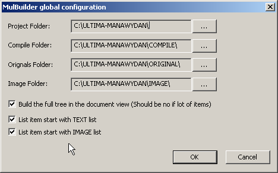
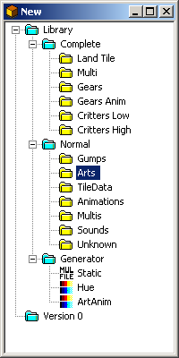
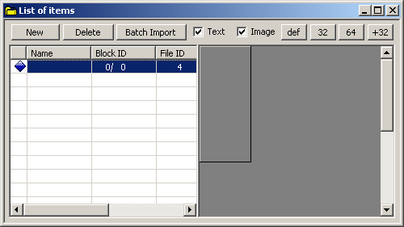
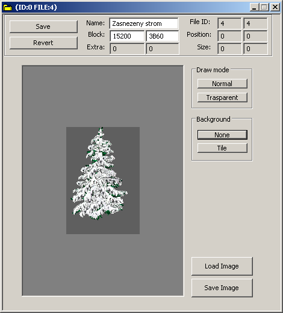
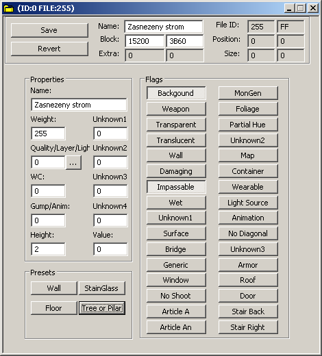

V tomto návodu vám ukážu jak vložit nový předmět do souboru verdata.mul.
K práci budeme potřebovat program **MulBuilder** (548 KB).

Nejprve si připravte novou grafiku. Nebudu tu rozebírat jak mají být velké obrázky atd. Můžete to zjistit pomocí InsideUO, prohlédnutím si pár originálních obrázků.

Spusťte MulBuilder a jako první si nastavte cesty k souborům v FILE/CONFIGURATION

**Project Folder** - Nastavení adresáře celého projektu
**Compile Folder** - Adresář kam se vám uloží vygenerované upravené soubory
**Originals Folder** - Adresář ve kterém máte uloženy originální soubory UO
**Image Folder** - Adresář s obrázkama itemů

Pokud nastavíte vše správně, klikněte na FILE/NEW. Otevře se vám nové okno.

Nyní klikněte na ARTS, otevře se vám další okno.

Klikněte na NEW a v seznamu se vám vytvoří první položka na kterou 2x klikněte. Zde už zadáváte parametry daného předmětu.

**Name** - Jméno itemu pro snadnější rozeznání pokud jich děláte víc najednou (nemá vliv na jméno ve hře).
**Block** - ID itemu pod kterým ho chceme vložit. Levá hodnota je číslo v DEC soustavě, pravá v HEX soustavě.
**Draw mode, Background** - Pomocí tlačítek můžeme zkontrolovat například transparentní barvu, zda vše souhlasí jak potřebujeme.
**Load Image** - Nahrátí grafické podoby itemu.
**Save Image** - Uložení grafické podoby itemu (hodí se, pokud máte na disku jen vytvořený projekt a nemáte k dispozici originální obrázek).

Vyplňte tedy údaje podle obrázku a klikněte na **SAVE**. Okno nyní můžete zavřít. Tímto způsobem můžeme vkládat další a další itemy. Nyní však musíme nastavit různé parametry, aby daný obrázek fungoval ve hře tak jak má.

Nyní klikněte v okně **NEW** na **TILEDATA**, následně na **NEW** a opět dvojklik na nově vytvořenou položku.

V horní části do položky **Name:** zadejte jméno itemu pro snadnější orientaci a do **Block:** zadejte číslo pozice itemu, kterému chcete nastavit atributy. V našem případě tedy 15200.

V okně **Properties** do položky **Name** zadejte jméno itemu, které se zobrazí v případě, že ve scriptu daného itemu nenadefinujete jméno jiné. Další nastavení je už jen na vás. Nejlepší je najít si programem InsideUO podobný item v originální grafice a potom zjistit pomocí některého z tiledata editorů jeho nastavení. Pokud vše máte nastavené, klikněte na **Save**.

Teď nám již nic nebrání vygenerovat upravené soubory. Klikněte tedy v hlavním okně na **ORIGINAL/IMPORT ALL ESSENCIAL** — chvilku počkejte. Nakonec vyberte **GENERATE/ALL** a na vybrané místo se vám uloží upravené soubory.

---

*Archived from the [Manawydan UO tools archive](http://ultima.manawydan.cz/) (originally by RadstaR, 2004-2016).*
