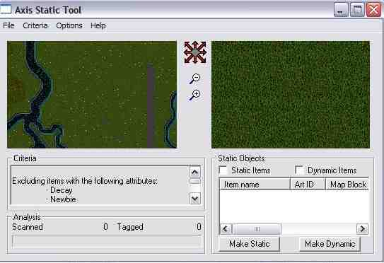
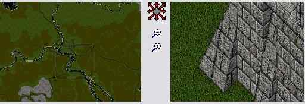
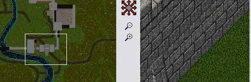
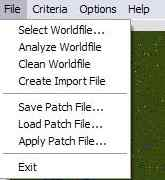
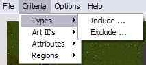
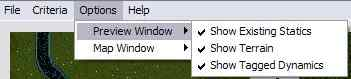
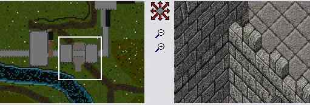
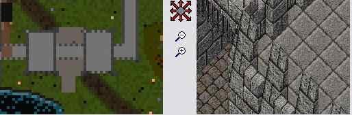
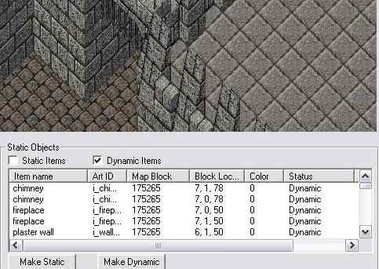

+++
title = "Jak na Static? (How to Use Static Tool)"
slug = "tutorial-jak-na-static"
date = 2014-08-21T00:00:00
draft = false
categories = ["Tutorials"]
tags = ["Lynx", "ultima.cz Archive"]

[params]
  source = "ultima-cz"
+++

Návod k modulu Static Tool, který je obsažen v Axisu a je určený pro zmrazení dynamických itemů na statické do mapy.

## Obecný popis

Static Tool se nachází v Axisu na kartě **Misc** vpravo. Po kliknutí se otevře okno se dvěma hlavními zobrazeními — v levém okně vidíte celkovou mapu, v pravém určitou vybranou část s detailním náhledem. Náhled zobrazuje pouze statické itemy již obsažené v souborech statics0.mul a staidx0.mul.

Mezi okny je kompas umožňující pohyb po mapě. Okna lze ovládat myší — kliknutím na místo v levém okně se zobrazí ve středu. Možné je také označit region myší.

## Menu FILES

- **Select Worldfile**: výběr sphereworld.scp ze složky Save
- **Analyze Worldfile**: analýza worldsavu
- **Clean Worldfile**: vymaže veškeré dynamické itemy ze světa
- **Create Import File**: vytvoří soubor pro import do static
- **Save Path File**: vytvoří Patch soubor
- **Load Patch File**: nahrání .pat souboru
- **Apply Patch File**: použití patche na statics0.mul a staidx0.mul

## CRITERIA

- **Types**: připojení/odpojení itemů podle typu
- **Art IDs**: připojení/odpojení podle ID
- **Regions**: připojí či odpojí itemy z vybraného regionu

## Postup

1. Spusťte utilitku
2. V menu vyberte váš worldsave
3. Zanalizujete jej
4. Na mapě najdete region k připojení (vytvoříte zelený čtverec)
5. Vpravo zaškrtnete zobrazení seznamu dynamických itemů
6. Novější Axis verze automaticky označí itemy jako "Pending Static"
7. U starších verzí vyberte itemy ručně a klikněte "Make Static"
8. V menu nastavíte, které itemy se mají připojit
9. Vyberete "Create Patch"
10. Použijete "Apply Patch"

Pokud použijete Apply Patch, bude to vypadat jako by program zmrzl — nezmrzl, pracuje ale velice pomalu.

Program vytvoří soubory s příponou .new — ty pak přejmenujte na .mul a přepište jimi původní (předtím si je zálohujte).

**Důležité:** Itemy, které jednou do static zmrazíte, už těžko vrátíte na dynamické. Zálohujte si sphereworld.scp a neužívejte možnosti Clean Worldfile.

---

*Archived from [ultima.cz](https://ultima.cz/) — Czech Ultima Online community site.*
