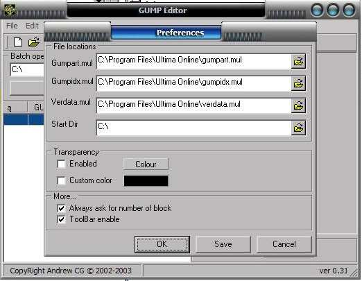
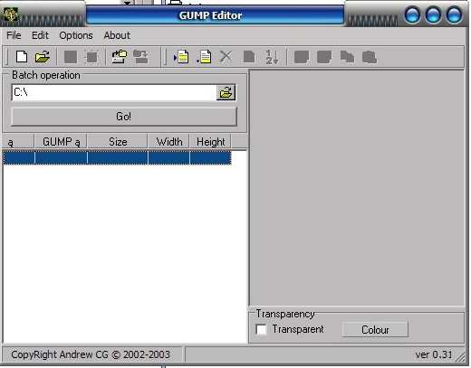
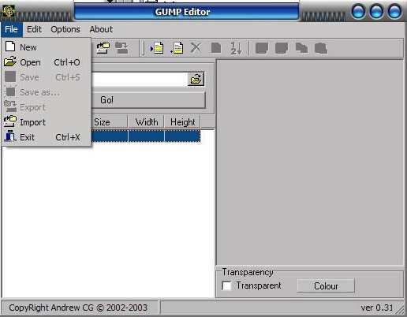
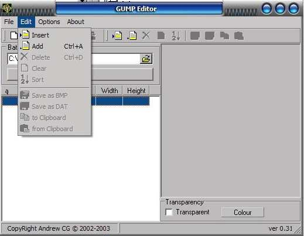
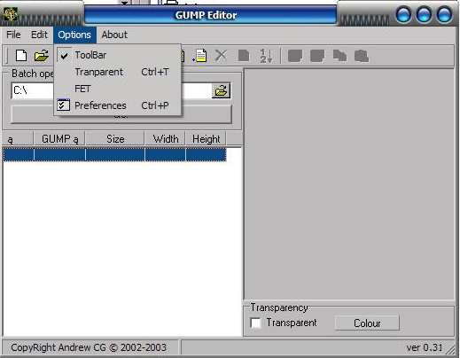
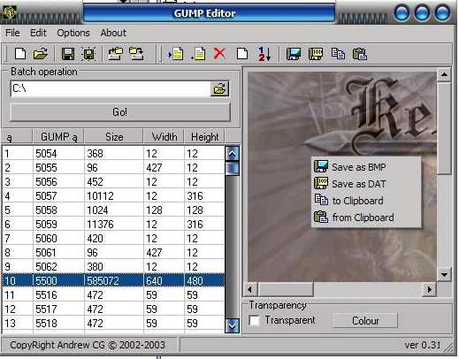
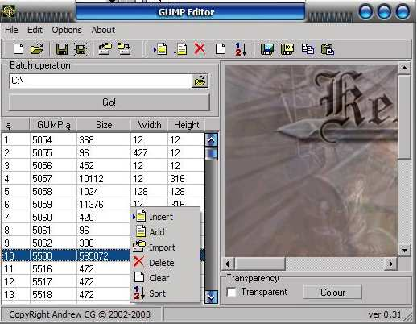

+++
title = "Jak na Verdata 2 - GUMP Editor"
slug = "tutorial-verdata-gump-editor"
date = 2014-08-21T00:00:00
draft = false
categories = ["Tutorials"]
tags = ["Lynx", "Manawydan Archive"]

[params]
  source = "ultima-cz"
+++

GUMP Editor je momentálně nejlepší program pro úpravu gumpů (grafická statická data). Na rozdíl od Paradise Gump Patcheru zvládá rychlé vykreslování obrázků a může pracovat jen s určitou částí grafických souborů k vytvoření patche.

## Instalace

Program se nijak neinstaluje, pouze si nakopírujete na harddisk a spustíte. Poté nastavte v Settings cesty k souborům.

## Menu

### FILE
New, Open, Save, Save as, Export, Import, Exit

### EDIT
Insert, Add, Delete, Clear, Sort, Save as BMP, Save as DAT, to Clipboard, from Clipboard

### OPTIONS
ToolBar, Transparent, FET, Preferences

## Postup tvorby patche

1. Otevřete verdata.mul soubor pomocí **Open**
2. V levém okně najděte požadovaný předmět pomocí kurzorových kláves
3. Klikněte pravým tlačítkem na náhled a vyberte **Save as BMP**

4. Upravte obrázek v grafickém programu
5. Doporučuji ukládat obrázky pod čísly, kterými je gump ve verdatech označený
6. Vytvořte nový soubor (**File > New**) a vkládejte upravené gumpy podle jejich čísel
7. Označte všechny upravené gumpy (Shift + kurzorová klávesa)
8. Klikněte **File > Save As** a uložte soubor pod názvem **PATCHDATA.DAT**

9. Zkopírujte program **VerdataPatcher.exe** a vytvořený patch do UO složky a spusťte

**Důležité:** To co je v obrázku černé bude ve hře díra. Při úpravách zachovejte správná čísla gumpů.

---

*Archived from [ultima.cz](https://ultima.cz/) — Czech Ultima Online community site.*
