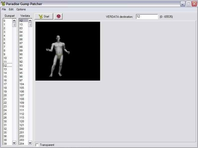
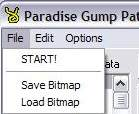
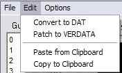
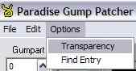
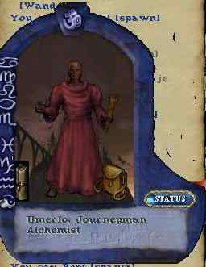
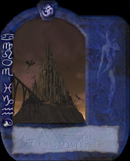
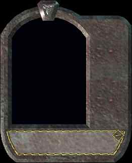

+++
title = "Jak na Verdata 1 - Paradise Gump Patcher"
slug = "tutorial-verdata-paradise-gump-patcher"
date = 2014-08-21T00:00:00
draft = false
categories = ["Tutorials"]
tags = ["Lynx", "ultima.cz Archive"]

[params]
  source = "ultima-cz"
+++

Tento seriál o tvorbě grafiky věnuji programu Paradise Gump Patcher, kterým lze předělat většinu oken. První díl se zabývá seznámením s programem.

## Úvod

Všechno kódování obrázků je v nejhorším možném formátu — BMP. Paradise Gump Patcher se nijak neinstaluje — jsou to 3 soubory. Rozbalte je do adresáře s UO a spusťte PGP.

## Popis rozhraní

Po spuštění a kliknutí na **START** se načte seznam itemů:

- **Gumpart**: obrázky, které UO obsahuje a lze je použít pro verdata přímo
- **Verdata**: bitmapy, které se právě používají a načítají se při spuštění hry

Každý obrázek má své ID, které se zadává do skriptů.

## Menu

- **START**: načte bitmapy a vytvoří seznam
- **LOAD BITMAP**: nahraje obrázek z externího souboru do verdat
- **SAVE BITMAP**: uloží vybranou bitmapu do BMP souboru
- **CONVERT TO DAT**: uloží upravený soubor do formátu DAT
- **PATCH TO VERDATA**: patchne verdata (bez možnosti návratu — vždy zálohujte!)
- **PASTE FROM CLIPBOARD**: uloží vybraný obrázek do schránky
- **COPY TO CLIPBOARD**: vloží obrázek ze schránky
- **TRANSPARENCY**: přepne do transparentního modu (zmizí černé pozadí)
- **FIND ENTRY**: vyhledávání podle zadané hodnoty

## Postup úpravy

1. Vyberte v pravém seznamu (verdata) obrázek, který chcete modifikovat
2. Uložte jej na disk pomocí **SAVE BITMAP**
3. Upravte obrázek v Photoshopu nebo jiném programu. Dodržte původní rozměry. U gumpů je transparentní barva černá — nepoužívejte čistě černou pro stínování, jinak se ve hře objeví díry

4. Vyberte ve verdatech původní obrázek a klikněte na **LOAD BITMAP** — původní se přepíše (zatím ne trvale)
5. Zkontrolujte v modu **TRANSPARENCY**, zda jste nezanechali zbytky v jiné barvě než černé
6. Použijte **PATCH TO VERDATA** a zkontrolujte ve hře

---

*Archived from [ultima.cz](https://ultima.cz/) — Czech Ultima Online community site.*
