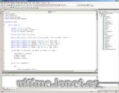

SDK pro práci se soubory UO v C#.

## Screenshot

## Downloads

- [Source code + DLL (.NET 1)](/files/manawydan/ultima_online_sdk.rar) (37 KB)
- [Source code + DLL (.NET 2, 2007)](/files/manawydan/ultima_online_sdk_2.rar) (91 KB)
- [Source code (.NET 2, 2008)](/files/manawydan/ultima_online_sdk_2_2.rar) (20 KB)

---

*Archived from the [Manawydan UO tools archive](http://ultima.manawydan.cz/) (originally by RadstaR, 2004-2016).*
