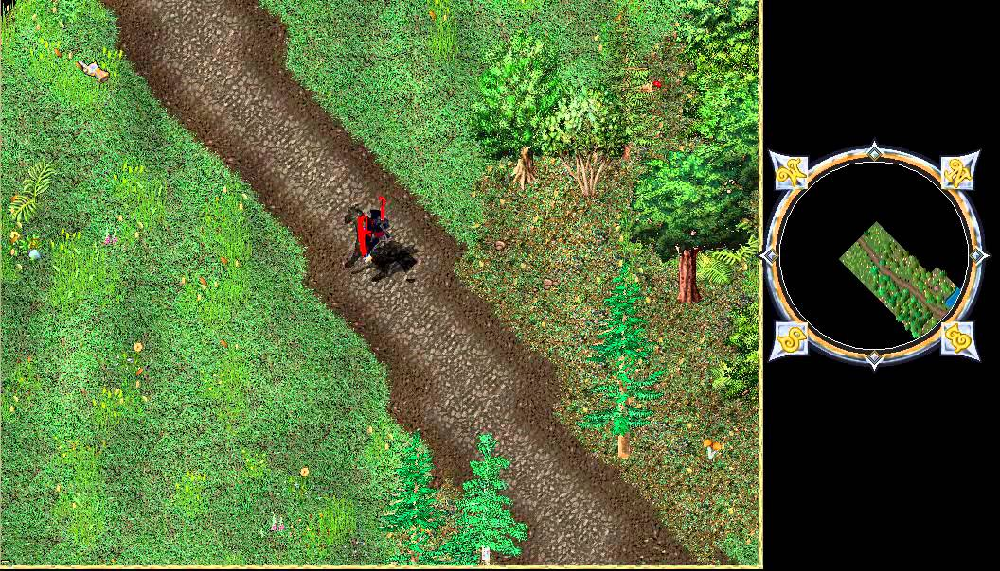

UltimaLive is a plugin system that enables real-time map editing on a running RunUO or ServUO server. Players with appropriate permissions can modify terrain, place statics, and alter the game world without server restarts or client patches. Changes are streamed to connected clients instantly. This is invaluable for shard development, allowing GMs to build and test world modifications in real-time. The archive includes the DLL plugins (both Debug and Release builds), documentation, and full C++ source code.

## Screenshot

## Downloads

- [UltimaLive](/files/toolbox/UltimaLive-master.zip) (11 MB)

---

*Archived from the [UO FreeShard Community Tool Box](https://archive.org/details/UOFreeShardCommunityToolBoxLastUpdate03.31.2019) (archive.org, 2019).*
