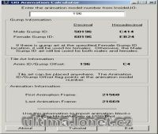

Program na výpočet pozice animace.

Program calculate first and last animation position.

## Screenshot

## Downloads

- [Download](/files/manawydan/uoanimcalc.rar) (15 KB)

---

*Archived from the [Manawydan UO tools archive](http://ultima.manawydan.cz/) (originally by RadstaR, 2004-2016).*
