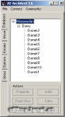

Program na stavění, extrahování a vkládání staveb do hry přes RunUO (1.0.0 a 2.0) s možností exportu i do jiných formátů.

## Screenshot

## Downloads

- [2.7.3 Client/Server](/files/manawydan/orbsydia/uoar273.rar) (771 KB)
- [2.6.2 Client/Server](/files/manawydan/orbsydia/uoar262.rar) (449 KB)
- [2.6.1 Client](/files/manawydan/orbsydia/uoar2_6_1.rar) (283 KB)
- [2.6.1 C# source code](/files/manawydan/orbsydia/uoar261source.rar) (1.5 MB)
- [2.6 Download](/files/manawydan/orbsydia/uoar2_6.rar) (359 KB)
- [Toolbox update](/files/manawydan/orbsydia/uoar_toolbox.rar) (21 KB)
- [2.4 Download](/files/manawydan/orbsydia/uoar2_4.rar) (331 KB)
- [2.4 C# source code](/files/manawydan/orbsydia/uoar2_4source.rar) (812 KB)

---

*Archived from the [Manawydan UO tools archive](http://ultima.manawydan.cz/) (originally by RadstaR, 2004-2016).*
