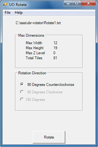

Program na otočení stavby.

This is a simple but effective tool in making it possible for developers to rotate a building they have created from south to west.

## Screenshot

## Downloads

- [Download](/files/manawydan/orbsydia/uorotator10beta.rar) (17 KB)

---

*Archived from the [Manawydan UO tools archive](http://ultima.manawydan.cz/) (originally by RadstaR, 2004-2016).*
