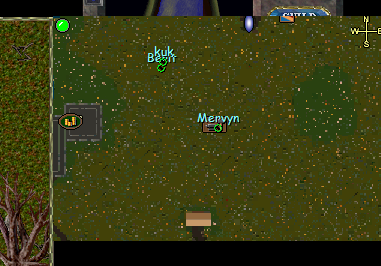

UOCartographer is a map rendering and cartography tool for Ultima Online. It can generate high-resolution map images from UO's map data files, create printable maps, and export map sections in various image formats. The Ignition variant adds additional features. Useful for creating reference maps for shard documentation, websites, or printed materials.

## Screenshot

## Download

This file (29 MB) exceeds the 25 MB hosting limit and will be available via Cloudflare R2 once configured. Contact the site maintainer for access.

---
*Archived from the [UO FreeShard Community Tool Box](https://archive.org/details/UOFreeShardCommunityToolBoxLastUpdate03.31.2019) (archive.org, 2019).*
