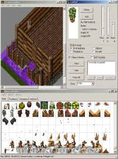

Program na vytvoření různých staveb.

Program to building structures.

## Screenshot

## Downloads

- [Download](/files/manawydan/uohe205.rar) (282 KB)

---

*Archived from the [Manawydan UO tools archive](http://ultima.manawydan.cz/) (originally by RadstaR, 2004-2016).*
