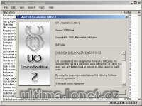

Program na úpravu souborů cliloc. Vytvořil Ravenal.

Program for editing of cliloc files, programmed by Ravenal.

## Screenshot

## Downloads

- [Download](/files/manawydan/orbsydia/uole2.exe) (422 KB)

---

*Archived from the [Manawydan UO tools archive](http://ultima.manawydan.cz/) (originally by RadstaR, 2004-2016).*
