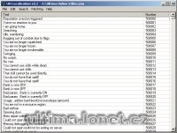

Program na úpravu souborů cliloc.

Program to localization cliloc files.

## Screenshot

## Downloads

- [Download 2.2](/files/manawydan/uolocalization22.rar) (22 KB)
- [Download 2.1](/files/manawydan/uolocalization.rar) (21 KB)

---

*Archived from the [Manawydan UO tools archive](http://ultima.manawydan.cz/) (originally by RadstaR, 2004-2016).*
