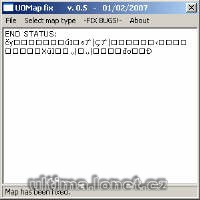

Program na opravu "zubů" vznikajících při generování mapy.

Program fix "teeths" in map.

## Screenshot

## Downloads

- [Download](/files/manawydan/uomapfix06.rar) (445 KB)

---

*Archived from the [Manawydan UO tools archive](http://ultima.manawydan.cz/) (originally by RadstaR, 2004-2016).*
