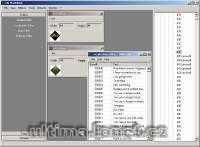

Program na úpravu různých souborů UO.

MUL files editor.

## Screenshot

## Downloads

- [Download](/files/manawydan/uomuleditor068.rar) (1.16 MB)

---

*Archived from the [Manawydan UO tools archive](https://web.archive.org/web/2015/http://ultima.manawydan.cz/) (originally by RadstaR, 2004-2016).*
