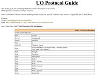

Seznam UO packetů.

This is a complete UO protocol PDF file, from T2A to most recent KR client.

## Screenshot

## Downloads

- [Download PDF](https://files.uo.wzk.cz/manawydan/kons/UO_Protocol_Guide.pdf) (383 KB)

---

*Archived from the [Manawydan UO tools archive](https://web.archive.org/web/2015/http://ultima.manawydan.cz/) (originally by RadstaR, 2004-2016).*
