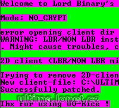

Program na odstranění enkrypce z klienta.

Program remove client encryption.

## Screenshot

## Downloads

- [Download](https://files.uo.wzk.cz/manawydan/uorice.rar) (83 KB)
- [Source code](https://files.uo.wzk.cz/manawydan/uorice_source.rar) (1.23 MB)

---

*Archived from the [Manawydan UO tools archive](https://web.archive.org/web/2015/http://ultima.manawydan.cz/) (originally by RadstaR, 2004-2016).*
