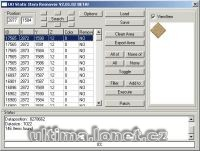

Program na odstranění static itemů.

Program remove items from statics.

## Screenshot

## Downloads

- [Download](/files/manawydan/uosir20102beta.rar) (345 KB)

---

*Archived from the [Manawydan UO tools archive](https://web.archive.org/web/2015/http://ultima.manawydan.cz/) (originally by RadstaR, 2004-2016).*
