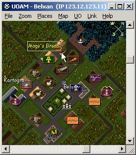

UOAM (UO Auto Map) is the classic real-time map application for Ultima Online. It displays your character's position on a detailed map of Britannia with support for tracking party members, marking locations, sharing coordinates with other UOAM users over a network, and treasure map coordinate lookup. The archive includes UOAM 8.3 Beta, version 8.2.0.1, and the UOAM Server component (v21) for hosting shared map sessions. One of the most iconic UO companion tools ever created.

## Screenshot

## Downloads

- [UOAM (multiple versions)](/files/toolbox/UOAM.zip) (1.0 MB)

---
*Archived from the [UO FreeShard Community Tool Box](https://archive.org/details/UOFreeShardCommunityToolBoxLastUpdate03.31.2019) (archive.org, 2019).*
