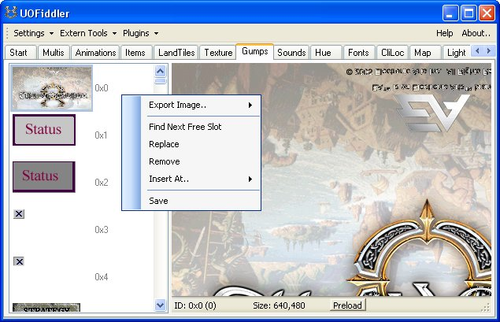
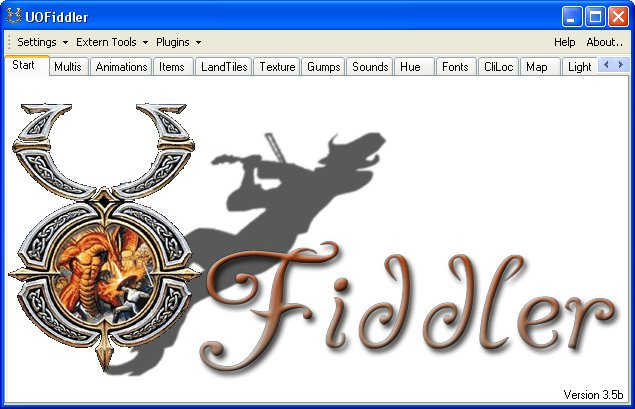
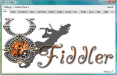

## Features

Based on Ultima SDK its an Tool to view and alter almost every 2d Client file.

The application once connected to your client files allows a variety of options for visualizing the UO client data.

  * Multis – Multi List with Compenent Details for each
  * Animations – Animation frama data
  * Items – Item List
  * Land Tiles – Land Tile List
  * Texture – Texture List
  * Gumps – List of Available Gump Components.
  * Sounds – Sound list
  * Hue – Hue List
  * Fonts – Client Fonts
  * CliLoc – Client Localization Data
  * Map – Map Data
  * Light – Light Sources
  * Speech – Speech Data
  * Skills – Skill Data
  * Animdata – Item Animation Data
  * MultiMap/Facets – Multimap Data (Used for Tmaps)
  * Dress – Player Body Dress Data
  * TileData – Item Tile Data
  * RadarColor – Color Data for Radar Visualization
  * SkillGrp – Default Skill Groupings

## Screenshots

 

## Downloads

  * [UOFiddler4.6.zip](</files/UOFiddler4.6.zip>)

## Manawydan Archive Downloads

> CZ: Program na prohlížení mul souborů (něco jako InsideUO).

  * [UOFiddler 4.6 SVN 2133 (Manawydan)](/files/manawydan/uofiddler_svn2133.rar) (493 KB)
  * [UOFiddler 4.5g](/files/manawydan/uofiddler45g.rar) (810 KB)
  * [UOFiddler 4.5b](/files/manawydan/uofiddler45b.rar) (1.41 MB)

## Others

  * [UOFiddler UOP Extractor plugin 0.1](</files/UOPPacker.zip>) – Extract UOP to MUL, Pack MUL to UOP 
    * There are some who are having problems when using the RunUO’s Legacy MUL Converter to pack/unpack UOP files, so I decided to create a 3rd party GUI to help the extraction process  
Just drop the DLL into your UOFiddler plugin folder then load it  
The GUI is pretty self explanatory. It may contain some typos, sorry hehe  
The main reason I released it under Custom Artwork is that there is no specific category for 3rd party tools  
**if you do not want to compile, just navitagate to “UOPPacker\obj\Debug\” inside the ZIP file and extract the “UOPPacker.dll” to your UOF plugins folder**
