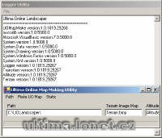

## Features

Program to generate map files from BMP images.

## Screenshots

 

## Downloads

  * [UOLandscaper.zip](</files/UOLandscaper.zip>) – 1.4

## Manawydan Archive Downloads

> CZ: Program na vygenerování mapy (MAPx.mul) z BMP obrázku.
>
> EN: Program generate map files from BMP images.

  * [UO Landscaper 1.4 (Manawydan)](/files/manawydan/orbsydia/uol1_4.rar) (671 KB)
  * [UO Landscaper 1.3](/files/manawydan/orbsydia/uol1_3.rar) (784 KB)
  * [UO Landscaper 1.2](/files/manawydan/orbsydia/uol1_2.rar) (723 KB)
  * [UO Landscaper 1.1](/files/manawydan/orbsydia/uol1_1.rar) (565 KB)

---

## Historical Comments

> **S** (2017-08-22):
>
> Thanks for this website 🙂

