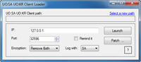

Program na odstranění enkrypce a změnu IP pro připojení přes UOKR nebo UOSA klienta.

This Program can change IP and patch Encryption of the new UO:Stygian Abyss Client.

## Screenshot

## Downloads

- [Download 2.3](https://files.uo.wzk.cz/manawydan/kons/uosaloader23.7z) (40 KB)

---

*Archived from the [Manawydan UO tools archive](https://web.archive.org/web/2015/http://ultima.manawydan.cz/) (originally by RadstaR, 2004-2016).*
