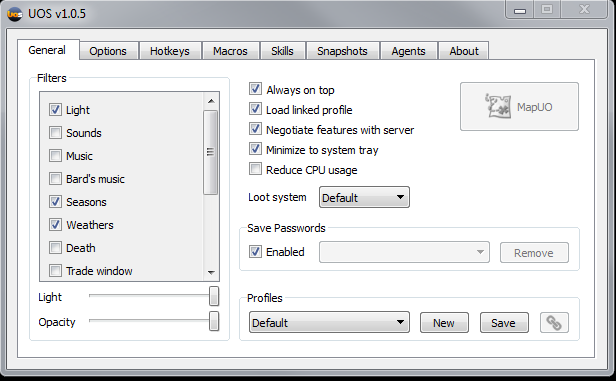

UOSteam is a powerful macro and automation tool for Ultima Online that became the preferred alternative to Razor on many freeshards. It features a custom scripting language designed specifically for UO automation, with commands for movement, combat, item manipulation, and complex conditional logic. The archive includes UOSteam 1.0.5, the official documentation PDF, and the community script repository (uosteam-master) with example scripts for various tasks including gate entry, boat placement, and player detection.

## Screenshot

## Downloads

- [UOSteam 1.0.5 + Scripts](/files/toolbox/UOSTEAM.zip) (13 MB)

---
*Archived from the [UO FreeShard Community Tool Box](https://archive.org/details/UOFreeShardCommunityToolBoxLastUpdate03.31.2019) (archive.org, 2019).*
