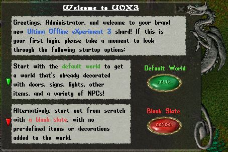

UOX3 (Ultima Offline eXperiment 3) is one of the oldest UO server emulators, written in C++. It was among the first projects to allow running a private UO server and has historical significance in the freeshard community. The archive includes the all-in-one packages for both Windows and Linux (version 0.99.2b), plus a GumpStudio plugin for UOX3 dialog development.

## Screenshot

## Downloads

- [UOX3](/files/toolbox/UOX3.zip) (5.2 MB)

---

*Archived from the [UO FreeShard Community Tool Box](https://archive.org/details/UOFreeShardCommunityToolBoxLastUpdate03.31.2019) (archive.org, 2019).*
