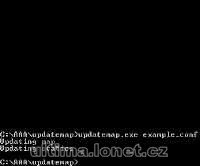

Program na nahrazení itemů určitého ID v mapě/statice jinými.

Program replace selected item id in map with another.

## Screenshot

## Downloads

- [Download](/files/manawydan/updatemap.rar) (123 KB)

---

*Archived from the [Manawydan UO tools archive](http://ultima.manawydan.cz/) (originally by RadstaR, 2004-2016).*
