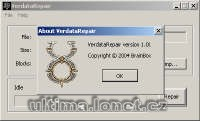

Programy na patchování a opravu verdata.mul.

Programs to patch and repair verdata.mul file.

## Screenshot

## Downloads

- [Download](/files/manawydan/verdata.rar) (105 KB)

---

*Archived from the [Manawydan UO tools archive](http://ultima.manawydan.cz/) (originally by RadstaR, 2004-2016).*
