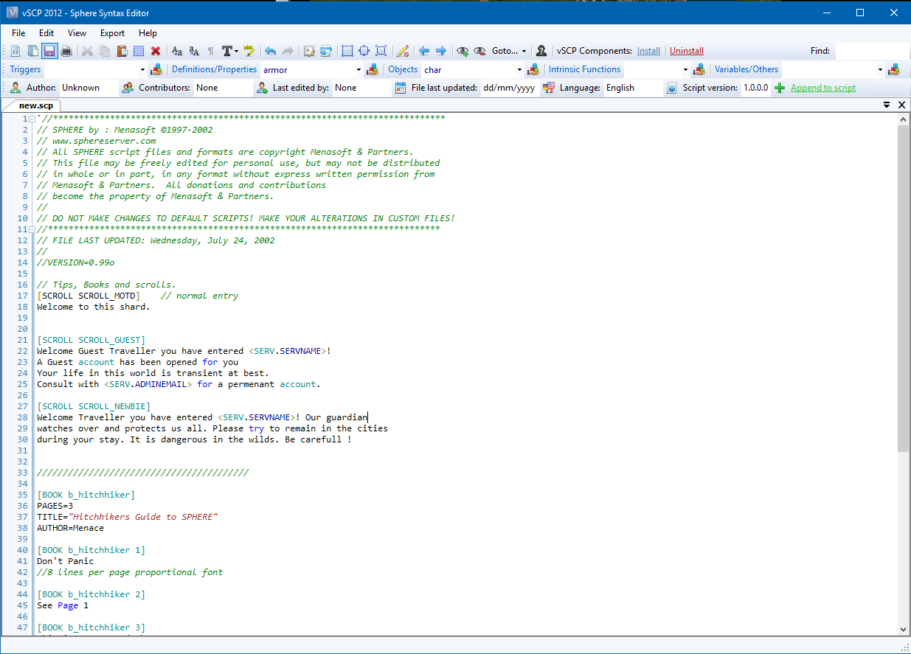

## Features

vSCP is the most complete and up-to-date syntax editor for sphere scripting. It does contain syntax highlighting, autocomplete, folding markers to specify blocks of code that can expand or collapse, bookmarks, autoindent, find/replace/gotoline engine, help guide for all the sphere elements added to your code, and more!  
vSCP definitely improves your scripting process. Give it a try, you won’t regret!

## Screenshots

## Downloads

  * [vscp.zip](</files/vscp.zip>)

## Others

  * [Official vSCP website](<https://forum.spherecommunity.net/sshare.php?srt=4&prj=3>)
