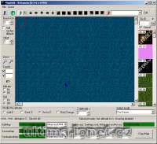

Program na editaci mapy s podporou POLu.

Program edit MAPx.mul files with POL support.

## Screenshot

## Downloads

- [Download + Source Code](https://files.uo.wzk.cz/manawydan/worldforgepol.rar) (578 KB)

---

*Archived from the [Manawydan UO tools archive](https://web.archive.org/web/2015/http://ultima.manawydan.cz/) (originally by RadstaR, 2004-2016).*
