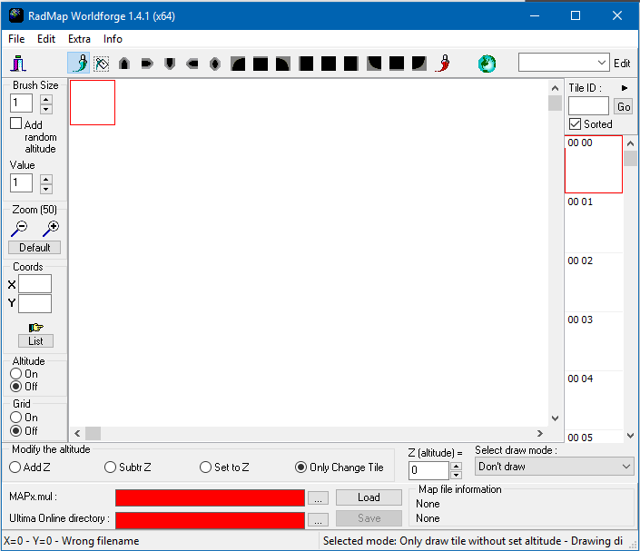
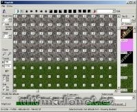

## Features

Program to edit files from mapX.mul files.

## Screenshots

 

## Downloads

  * [radmap_worldforge141.zip](<https://files.uo.wzk.cz/radmap_worldforge141.zip>) – RadStar’s version to edit files from map0.mul to map5.mul.
  * [WorldForge.zip](<https://files.uo.wzk.cz/WorldForge.zip>) – Original program to edit map0, map2 and map3.mul files (Delphi source code included).

## Manawydan Archive Downloads

> CZ: Program na editaci mapy.

  * [WorldForge 6.4 R2 Map0 (Manawydan)](https://files.uo.wzk.cz/manawydan/wf64r2map0.rar) (452 KB)
  * [WorldForge 6.4 R1 Map2](https://files.uo.wzk.cz/manawydan/wf64r1map2.rar) (581 KB)
  * [WorldForge 6.4 R1 Map3](https://files.uo.wzk.cz/manawydan/wf64r1map3.rar) (578 KB)
  * [WorldForge 6.4 R1 Delphi source code](https://files.uo.wzk.cz/manawydan/worldforge64r1_source.rar) (523 KB)
