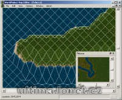

Program na úpravu map.

Program edit MAPx.mul files.

## Screenshot

## Downloads

- [Download](/files/manawydan/punt/wfmap.rar) (302 KB)
- [C source code](/files/manawydan/punt/wfmapsrc.rar) (110 KB)
- [Required DLL (Qt4)](/files/manawydan/punt/qt4.rar) (4.33 MB)

---

*Archived from the [Manawydan UO tools archive](http://ultima.manawydan.cz/) (originally by RadstaR, 2004-2016).*
