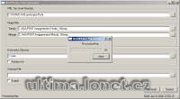

Program na vygenerování mapy z BMP. Obrázek musí být ve formátu pro UO Landscaper.

Program generate maps and statics files from BMP pictures in UO Landscaper format.

## Screenshot

## Downloads

- [Download](/files/manawydan/punt/mapgenerator2.rar) (429 KB)
- [Required DLL (Qt4)](/files/manawydan/punt/qt4_1_4.rar) (3.87 MB)
- [Altitude mod](/files/manawydan/punt/mapgen2_altitude_mod.rar) (119 KB)

---

*Archived from the [Manawydan UO tools archive](http://ultima.manawydan.cz/) (originally by RadstaR, 2004-2016).*
