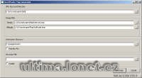

Program na vygenerování mapy z BMP obrázků pro UO Landscaper (používá i jeho transitions).

Program generate maps and statics files from BMP pictures from UO Landscaper (use his transitions).

## Screenshot

## Downloads

- [Download](/files/manawydan/punt/mapgenerator.rar) (125 KB)
- [Required DLL (Qt4)](/files/manawydan/punt/qt4_1_3.rar) (5.61 MB)

---

*Archived from the [Manawydan UO tools archive](http://ultima.manawydan.cz/) (originally by RadstaR, 2004-2016).*
