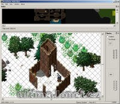

Program na úpravu multi.mul.

Program edit file multi.mul.

## Screenshot

## Downloads

- [Download](/files/manawydan/punt/wfmulti.rar) (266 KB)
- [C source code](/files/manawydan/punt/wfmultisrc.rar) (104 KB)
- [Required DLL (Qt4)](/files/manawydan/punt/qt4.rar) (4.33 MB)

---

*Archived from the [Manawydan UO tools archive](http://ultima.manawydan.cz/) (originally by RadstaR, 2004-2016).*
