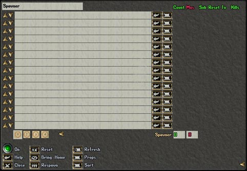

XMLSpawner is the universal NPC and item spawning system for RunUO and ServUO servers. It replaced the built-in spawner with a vastly more powerful XML-based system supporting conditional spawning, timed events, quest triggers, attached properties, and complex scripting logic. Virtually every freeshard uses XMLSpawner for world population. The package includes XMLSpawner 2.1, the Orb variant, and comprehensive installation instructions.

## Screenshot

## Downloads

- [XMLSpawner 2.1](/files/toolbox/XMLSpawner-master.zip) (1.5 MB)

---

*Archived from the [UO FreeShard Community Tool Box](https://archive.org/details/UOFreeShardCommunityToolBoxLastUpdate03.31.2019) (archive.org, 2019).*
